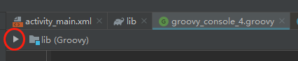
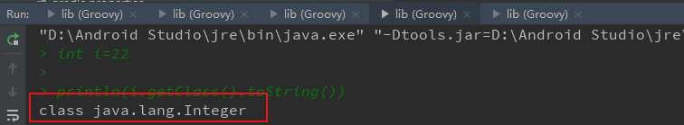
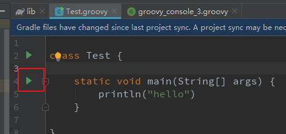
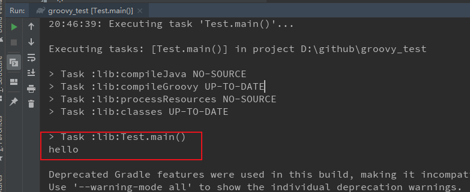

##### 运行Groovy的两种方式

1.脚本方式

2.module方式


##### 脚本方式

as里点击菜单项 tools->groovy consoles... 新建一个groovy文件，编写如下代码：

```
int i = 999
println(i.class)
```

然后点击如下按钮执行脚本：



查看运行结果：




##### module方式

新建一个java lib module;

删除src下的java目录，新建groovy目录；

新建groovy类文件，Test.groovy,代码如下：

```
class Test {

    static void main(String[] args) {
        println("hello")
    }

}
```

修改module下的build.gradle文件，修改如下：

```
//apply plugin: 'java-library'
apply plugin: 'groovy' // 1
dependencies {
    implementation fileTree(dir: 'libs', include: ['*.jar'])
    implementation localGroovy()  // 2
}

//sourceCompatibility = "7"
//targetCompatibility = "7"
```

注释为以前的java lib 插件代码， 1和2为groovy插件配置代码，表明本项目支持groovy

运行groovy: 执行Test类的main方法，



查看运行结果：



​                                                                           by liu peng 2020 0504